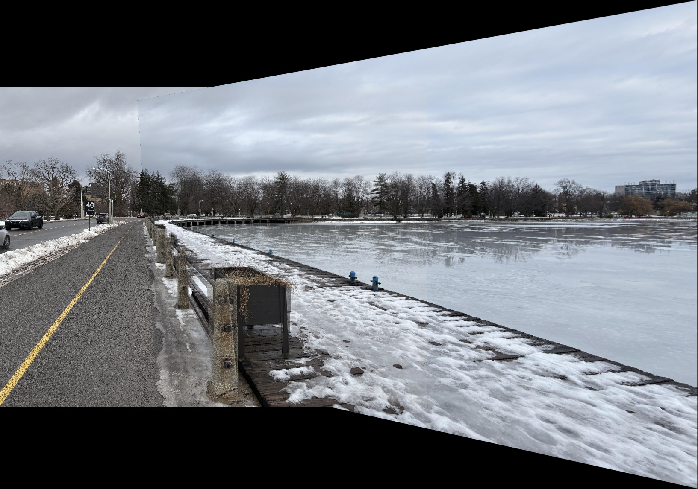

# Computer Vision Image Stitching

This coursework-based project builds a panorama from two overlapping photographs. It detects SIFT features, matches them with FLANN and Lowe's ratio test, estimates a projective homography with a small RANSAC implementation, and warps the images into a shared coordinate system.

This project was completed as a computer vision course assignment. The repository is a cleaned and documented version of that coursework. Assignment instructions, grading files, and student identifiers are intentionally excluded.

The two source photographs in `data/` were taken by my course instructor, Majid Komeili, and provided for the assignment. The panorama shown below was generated from those photographs by this project.

## Result



## Pipeline

1. Load and resize the two source images.
2. Detect SIFT keypoints and descriptors.
3. Match descriptors with FLANN and filter them with Lowe's ratio test.
4. Estimate a right-to-left homography with Direct Linear Transform and RANSAC.
5. Warp the right image and blend the overlapping area with the left image.

## Run locally

```bash
python -m venv .venv
.venv\Scripts\activate
pip install -r requirements.txt
python image_stitching.py
```

On macOS or Linux, activate the environment with `source .venv/bin/activate`.

Useful options:

```bash
python image_stitching.py --left data/img_left.jpg --right data/img_right.jpg --output output/stitched_image.jpg --width 1000
```

## Tests

```bash
pytest -q
```

The tests use synthetic point correspondences to check the DLT calculation and confirm that RANSAC rejects outliers.

## Technologies

- Python
- NumPy
- OpenCV
- SIFT and FLANN
- Homography estimation and RANSAC
